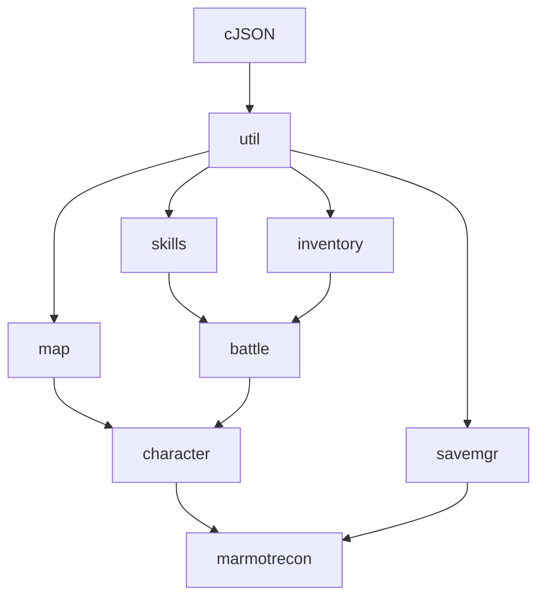

# MARMOT RECON
- [MARMOT RECON](#marmot-recon)
  - [模块](#模块)
  - [地图](#地图)
    - [简介](#简介)
    - [地理信息](#地理信息)
    - [环境](#环境)
    - [地图中目前可能存在的重要地点](#地图中目前可能存在的重要地点)
    - [敌对生物 YXT](#敌对生物-yxt)
  - [剧情（背景）](#剧情背景)
  - [战斗](#战斗)
    - [行动说明](#行动说明)
    - [注意事项](#注意事项)
  - [仓库（物品栏）](#仓库物品栏)
    - [需要拥有的功能](#需要拥有的功能)
    - [物品](#物品)
    - [背包界面的排版](#背包界面的排版)
  - [Settings](#settings)
    - [语言设置](#语言设置)
      - [说明](#说明)
    - [仓库设置](#仓库设置)
  - [角色](#角色)
    - [属性](#属性)
    - [战斗技能](#战斗技能)
    - [位置](#位置)
    - [可装备](#可装备)
  - [其他](#其他)
    - [collect2.exe: error: ld returned 1 exit status](#collect2exe-error-ld-returned-1-exit-status)
  - [log](#log)
  - [TODO:](#todo)

---

## 模块

- 仓库
- 地图
- 设置
- 人物
- 存档管理器
- 通用
- 技能
- 战斗

---

## 地图
### 简介
D20M10星球
南北两极有超强磁场
此地图目前由49*49个方格组成。玩家通过wasd四个方向键（按下a，然后按下enter）来实现人物的“移动”
地图分为第一层四个区域和第二层，主角的飞船迫降在第一层。四个区域的划分暂时未定，但每个区域都需要升级穿在身上的**抗压服**才能进入下一个区域。
### 地理信息
   - **大小**
      - 高度：6-10行
      - 宽度：每行 16-23列
   - **点位**
     - E: 敌对单位
     - M: 矿物资源
     - G: 抽奖
     - *: 无
### 环境
  - 气候恶劣
  - 能见度低
  - 空气具有腐蚀性，大气压强异常强大
  - （带添加）
### 地图中目前可能存在的重要地点
  - 飞船坠毁的坐标
  - yxt 的坐标
  - 交易场所？
  - （待添加）
### 敌对生物 YXT
<--是中文异形体的拼音首字母缩写-!>，居住于D20M10的生物，目前发现的种类数量为1.
(独居生物，对外来生物持敌对状态。)
幼年成长为成年后，离开舒适圈，寻找新的住宅地
（幼年攻击力低，防御力高；成年则相反；也有特例）
|                 | ability to attack | ability to defend |
| --------------- | :---------------: | ----------------: |
| normal larva    |        rr         |              test |
| normal adult    |                   |                   |
| corrupted larva |                   |                   |
| corrupted adult |                   |                   |

---

## 剧情（背景）
第一部分
接到指令探索D20M10星球
飞船迫降，砸出一个坑（临时住所），坑的空间不大，但可以利用工具来扩建
分析坠毁原因：磁场干扰k
幸运的是：逃生舱安全着陆，母船离逃生舱不远（肉眼可见），PAD还能弄，有补给。
第二部分
修好无线电接收器之后，不断收到求救信号
在探索这些求救信号后，发现更多的可用物品，并且这个星球秘密也在慢慢揭开
第三部分
收集所有可以用来造火箭的材料
关闭磁场强化器，坐火箭返回地球

---

## 战斗
### 行动说明
- 一回合只能进行一次行动。
- 敌方单位有和你一样的行动选项。
- attack：对敌方单位进行一次攻击(有几率触发暴击,暴击伤害=普通伤害*150%)。
- duck：敌方单位的下一次攻击进行**闪避判定**。如果判定生效你免疫受到的攻击伤害; 如果判定无效且敌人发动攻击,你将受到攻击伤害* **200%** 。
- heal：恢复已损失生命值的 50% 每次战斗限用**一次**。
- power up：以扣除**血量**为代价，提升暴击率和攻击力。
- power down：以降低**暴击率和攻击力**为代价，恢复血量。
### 注意事项
- 战斗中可能会出现一对多的情况
- 每次战斗只能使用**一次** heal 技能

---

## 仓库（物品栏）
### 需要拥有的功能
- [x] *查看背包物品以及数量 并 在需要的情况下调出物品的各项属性
- [ ] *物品编号，第一格是一号，以此类推
- [ ] *物品与物品间在背包位置中的调换
- [x] *合并相同的物品
- [ ] 背包容量可以在特定地点完成升级后提升容量
   | lv1  | lv2  | lv3  |
   | :--- | :--- | :--- |
   | 15格 | 30格 | 50格 |
   | 一栏 | 二栏 | 三栏 |
- [ ] （待添加）
### 物品
| item name                     | ID         | Type              | site        | function                                         |
| :---------------------------- | :--------- | :---------------- | :---------- | :----------------------------------------------- |
| copper                        | MR:METAL1  | material          | underground |                                                  |
| silver                        | MR:METAL2  | material          | underground |                                                  |
| iron                          | MR:METAL3  | material          |             |                                                  |
| quartz                        | MR:METAL4  | material          |             |                                                  |
| grass                         | MR:MAKING  | material          | ground      | make fiber                                       |
| stone                         | MR:STONE1  | material          |             |                                                  |
| dark_tree_branch              | MR:BRANCH  | material & weapon | ground_tree |                                                  |
| dark_tree_wood                | MR:WOOD    | material          | ground_tree |                                                  |
|                               |            |                   |             |                                                  |
|                               |            |                   |             |                                                  |
| Crush_resistance_box          | MR:BOX1    | container         |             | store your things                                |
| corrosion__resistance_box     | MR:BOX2    | container         |             | store your things                                |
|                               |            |                   |             |                                                  |
| crush_resistance_cloth        | MR:CLOTH1  | OUTSET            |             | protect yourself from the harsh environment      |
| radioaction_resistance_cloth  | MR:CLOTH2  | OUTSET            |             | protect yourself from the radioacted environment |
| recycle_cloth                 | MR:CLOTH2  | OUTLET            |             |                                                  |
| rebar(钢筋)from the spaceship | MR:WEAPON1 | weapon            |             | attack                                           |
|                               |            |                   |             |                                                  |
|                               |            |                   |             |                                                  |
|                               |            |                   |             |                                                  |
|                               |            |                   |             |                                                  |
### 背包界面的排版
1.
| NO. | Item_name | Amount |
| --- | --------- | ------ |
| 1   | bronze    | 68     |
2.
|     |     |     |
| --- | --- | --- |
|     |     |     |
|     |     |     |

---

## Settings
### 语言设置
#### 说明
将所有文本打印信息写在txt文件中，方便语言切换
把文本信息都写在 .txt 里，程序运行之后从txt中提取句子，放入char *context[100]中，输入第一句话就context[0]
2019/9/23更新：congtxt中提取中文出现乱码（暂时无法解决）
用context[3] [50]，存储英文语句
- [x] 多语言
  - [x] 中文
  - [x] 英语
### 仓库设置
- [x] 关闭 / 显示背包内物品的详细信息

---

## 角色
### 属性
- 名称：从json获取
- 等级：初始1级别
- 经验值：升级的经验值随等级变化
- 生命值：基础随等级变化
- 攻击力：基础随等级变化
- 暴击几率：初始 5%
- 暴击伤害：初始 50%
### 战斗技能
- 攻击
- 闪避：无效敌人下一次攻击
- 战力提升：扣除一定血量，提升暴击率和攻击力
- 战力下降：恢复一定血量，降低暴击率和攻击力
- 回复：恢复一定血量，一场战斗只能使用一次
### 位置
- 当前位置
- 住所的位置
### 可装备
- 套装
- 饰品
- 宠物

---

## 其他
### collect2.exe: error: ld returned 1 exit status
这个错误提示的意思是这个程序正在运行了，我没法在打开一次。
解决办法1：关闭正在运行的窗口。
解决办法2：没找到窗口，win+r输入msinfo32， 软件环境->正在运行的任务->查找PID ，cmd里输入  tskill PID

---

## log
**2022-7-13**
save management (user.json) 10%

**2022-7-14**
save management (user.json) 90%

**2022-7-15**
save management (user.json) 99%
map: struct <=> json

**2022-7-18**
attributes of character nd enemy

**2022-7-20**
weighted rand
battle reward

**2022-7-22**
对 E 进行互动
重要提示高亮显示
角色和敌对单位合并为统一结构 mrEntity
战斗要素: 
1. attack
2. duck
3. power up
4. power down
5. heal

**2022-7-23**
完善了显示颜色
完成对 M 点位的互动

---

## TODO:
- [ ] chara interacts with a given position
  - [x] E
  - [x] M
  - [ ] G
- [ ] update attr based on the level
- [ ] 装备武器
- [ ] power up 和 power down 进行优化
- [ ] 引入等级和经验值
- [ ] 显示背包物品